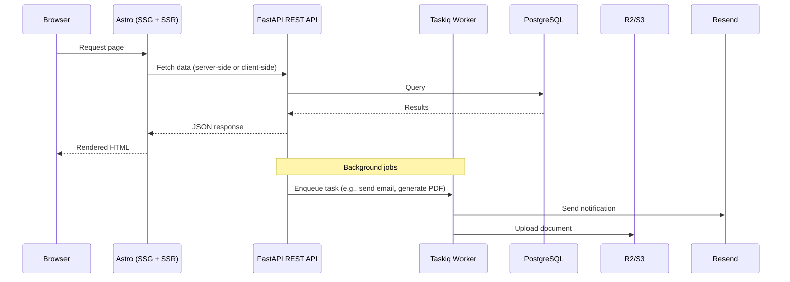

# FastAPI Astro E-commerce

E-commerce application to host your own webstore.

Still early development, the backend is most of the way there for an MVP, while the frontend is still in progress. Contributions are welcome.

### Who is this for?
- People who want to host their own e-commerce infrastructure without vendor lock-in
- People who want a highly customisable system that can be extended to suit their requirements
- People —_with time on their hands_— who don't want to pay monthly fees for a SaaS e-commerce platform
- People who want to learn how to build a modern e-commerce application with FastAPI and Astro
- People with a passion for open-source software

## Features

- Product catalog with variants, categories, and attribute templates
- Product images with automatic thumbnail generation
- Customer and order management
- Shipping zones, rates, and delivery estimates
- Shopping cart with registered and guest checkout
- Transactional PDF documents auto-generated per order
- Multi-currency support with live exchange rates
- JWT authentication for customers and admin users
- Password reset flow for customers and admin users
- Email notifications
- Store configuration
- Structured logging

### Planned / In Progress

- Cloudflare R2 image and document storage
- Stripe payments
- Storefront (Astro SSG) - products, categories, cart, checkout, static pages
- Admin panel (Astro + React integration) - Store content management system
- Customer portal - order information & history, receipts, account management
- Search
- Static page management
- Sitemap generation
- Blog
- Discounts / Coupons

## Tech Stack

**Backend**

[](https://python.org)
[](https://fastapi.tiangolo.com)
[](https://postgresql.org)
[](https://sqlalchemy.org)
[](https://valkey.io)
[](https://taskiq-python.github.io)
[](https://docs.pydantic.dev)
[](https://alembic.sqlalchemy.org)
[](https://docker.com)
[](https://cloudflare.com)
[](https://stripe.com)

**Frontend**

[](https://astro.build)
[](https://react.dev)

## Architecture

Whilst this is a full-stack application, the backend is designed to be a headless e-commerce application, with a REST API that can be consumed by the frontend framework of your choice. 

The backend follows a modular architecture, with separate modules for different domains in favour of easy maintainability and scalability. It handles the full e-commerce lifecycle, including product catalog management, carts, orders, shipping, payments, currencies, and more. JWT authentication is used for both customers and admin users, with a password reset flow. The backend is designed to be fully asynchronous, with async endpoints and async database access. Pytest is used for testing, with an aim of 90%+ test coverage.

FastAPI as the web framework, SQLAlchemy with asyncio as the ORM, Pydantic for data validation, the database is PostgreSQL, with Alembic for migrations. Valkey is used as a message broker and task queue, with Taskiq for background tasks. The libraries were chosen for their modern features, community support, native async, strong typing, and testing capabilities, making them ideal for production environments.

Images and documents will be stored in Cloudflare R2, with automatic thumbnail generation for product images performed by the backend. Email notifications will be sent via Resend, with HTML templates for transactional emails. Stripe will be used for payment processing, with the backend handling the full payment lifecycle.

The frontend will be built with Astro, a modern static site generator, providing lightweight, fast, and SEO-friendly pages. The storefront will be almost entirely static, with islands of interactivity where required, such as the shopping cart and checkout. The admin panel and customer portal will use Astro's React integration, allowing for dynamic content.

The application uses Docker and Docker Compose for easy deployment and development.

### Project Structure

```
fastapi-astro-ecommerce/
├── compose.yml                  # Docker Compose configuration
├── compose.local.yml            # Local development overrides
│
├── backend/
│   ├── pyproject.toml           # Python dependencies
│   ├── Dockerfile               # Backend Dockerfile
│   ├── alembic.ini              # Alembic configuration
│   ├── alembic/
│   │   └── versions/            # Database migrations
│   ├── tests/                   # Test suite (mirrors src/)
│   │   ├── conftest.py
│   │   ├── test_admin/
│   │   ├── test_auth/
│   │   ├── test_cart/
│   │   ├── test_currencies/
│   │   ├── test_customers/
│   │   ├── test_orders/
│   │   ├── test_payments/
│   │   ├── test_products/
│   │   ├── test_shipping/
│   │   ├── test_store_config/
│   │   └── test_worker/
│   └── src/
│       ├── main.py              # FastAPI app entry point
│       ├── config.py            # Application settings
│       ├── database.py          # Async SQLAlchemy engine & session
│       ├── models.py            # Shared model base
│       ├── exceptions.py        # Global exception handlers
│       ├── constants.py         # Shared constants
│       ├── logging_config.py    # Logging configuration
│       ├── seed.py              # Initial seed data
│       │
│       ├── admin/               # Admin panel API
│       ├── auth/                # JWT creation & verification
│       ├── cart/                # Shopping cart (guest + registered)
│       ├── currencies/          # Multi-currency support
│       ├── customers/           # Customer accounts & profiles
│       ├── docs/                # PDF generation (invoices, receipts)
│       │   └── templates/       # HTML to PDF templates
│       ├── images/              # Product images & thumbnails
│       ├── notifications/       # Email dispatch via Resend
│       │   └── templates/       # Email HTML templates
│       ├── orders/              # Order lifecycle
│       ├── payments/            # Payment processing
│       ├── products/            # Product catalog, variants, categories
│       ├── shipping/            # Shipping zones & rates
│       ├── storage/             # Cloudflare R2 / S3 abstraction
│       ├── store_config/        # Store settings
│       └── worker/              # Taskiq background tasks
│
└── frontend/                    # Astro + React (work in progress)
```

**Each backend module** typically contains:

| File | Purpose |
|---|---|
| `models.py` | SQLAlchemy ORM models |
| `schemas.py` | Pydantic request/response schemas |
| `router.py` | FastAPI route handlers |
| `service.py` | Business logic (called by routers and tasks) |
| `dependencies.py` | FastAPI dependency injection |
| `exceptions.py` | Domain-specific exceptions |

### Data Flow



## Quick Start

### Prerequisites
- Docker + Docker Compose
- [uv](https://docs.astral.sh/uv/)

### Setup

```bash
git clone <repo-url>
cd fastapi-astro-ecommerce
cp .env.example .env
docker compose -f compose.yml -f compose.local.yml up --build
```

Default admin credentials: `admin@example.com` / `admin123`

API docs: [http://localhost:8000/api/v1/openapi.json](http://localhost:8000/api/v1/openapi.json)

## API

| Domain | Prefix | Access |
|---|---|---|
| Products | `/api/v1/products` | Public read, admin write |
| Cart | `/api/v1/cart` | Customer |
| Orders | `/api/v1/orders` | Customer + admin |
| Customers | `/api/v1/customers` | Public registration, customer profile |
| Admin | `/api/v1/admin` | Admin only |
| Store Config | `/api/v1/store-config` | Public read, admin write |
| Documents | `/api/v1/docs` | Customer download, admin manage |
| Images | `/api/v1/images` | Public read, admin upload |
| Shipping | `/api/v1/shipping` | Public read, admin manage |
| Payments | `/api/v1/payments` | Customer |

## Development

```bash
cd backend
uv sync                          # install dependencies
uv run ruff check .              # lint
uv run pytest                    # run tests
uv run alembic revision --autogenerate -m "description"  # create migration
```

## Environment Variables

| Variable | Default | Notes |
|---|---|---|
| `DATABASE_URL` | `postgresql+asyncpg://...` | Database connection |
| `POSTGRES_USER` | `ecommerce` | |
| `POSTGRES_PASSWORD` | `ecommerce` | |
| `AUTH_JWT_SECRET` | — | Change in production |
| `AUTH_JWT_EXP_MINUTES` | `60` | |
| `AUTH_REFRESH_TOKEN_EXP` | `30 days` | |
| `DEFAULT_CURRENCY` | `USD` | Base currency for the store |
| `NOTIFICATIONS_RESEND_API_KEY` | — | Email provider API key |
| `NOTIFICATIONS_EMAIL_ENABLED` | `false` | |
| `NOTIFICATIONS_FRONTEND_URL` | `http://localhost:4321` | Password reset links |
| `LOG_LEVEL` | `INFO` | |
| `LOG_FORMAT` | `console` | `console` or `json` |

## Inspiration

- [FastAPI Best Practices - Zhanymkanov](https://github.com/zhanymkanov/fastapi-best-practices)

## License

This project is licensed under the MIT License. See the [LICENSE](LICENSE) file for details.

## Contributing

Contributions are welcome! Please submit a pull request or open an issue for any bugs or feature requests.